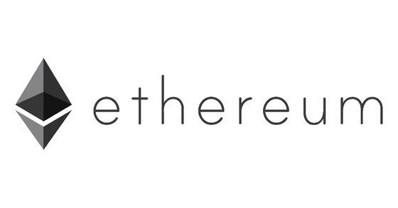

# BlockChian 개인 프로젝트

## **23.02.16 ~ 23.02.24**

## 0. :family: Personal Address

- 장정현 : [GitHub](https://github.com/JJeonghyun)

- Reference Page
  - [Etherscan](https://etherscan.io/)

 

---

 

## 1. :computer: Project Description

- Intro

  > 기존의 목표 페이지를 처럼 블록, 트랜잭션, 계정 주소에 대한 정보들을 볼 수 있는 사이트를 구현 하는 목적

  

---

## 2.:information_source: Project Information

- Purpose

  > 전체 블록, 전체 트랜잭션의 목록과 해당하는 블록, 트랜잭션의 상세정보들을 볼 수 있으며 또한, 계정에 대한 잔액과 처음과 마지막의 트랜잭션을 볼 수 있고 또한 해당 계정 관련 트랜잭션 목록들을 출력
  > 마지막으로 블록의 높이, 트랜잭션의 Hash값, 계정의 주소 등 검색할 수 있다

      

---

## 3. :satellite: Main Function

1. 전체 블록의 목록화

   > 전체블록들을 목록화하여 띄워준다
   >
   > 블록의 높이, 생성시간, 트랜잭션의 수, 수취인, 가스 소비량과 최대치, 해쉬값을 목록화 하여 볼 수 있다
   >
   > 많은 데이터들의 목록화를 효율적으로 볼 수 있도록 페이징네이션 기능 추가, 출력되는 목록의 수를 일정한 수로 조절하여 볼 수 있다

  

2. 전체 트랜잭션의 목록화

   > 전체블록들을 목록화하여 띄워준다
   >
   > 트랜잭션의 해쉬값, 블록의 높이, 발생시간, 보내는 사람, 받는 사람, 발생한 ether를 목록화 하여 볼 수 있다
   >
   > 많은 데이터들의 목록화를 효율적으로 볼 수 있도록 페이징네이션 기능 추가, 출력되는 목록의 수를 일정한 수로 조절하여 볼 수 있다

  

3. 검색 기능

   > 사용자가 블록의 높이, 계정 주소, 트랜잭션의 해쉬값을 검색하여 찾을 수 있다
   >
   > 존재하지 않는 정보들을 입력 시 404 NotFound 컴포넌트를 띄워주는 라우팅 설정

  

4.  블록의 상세정보

    > 블록의 상세정보를 띄워준다
    >
    > 블록의 높이, 생성시간, 트랜잭션의 수, 수취인, 난이도, 크기, 가스 소비량과 최대치, 해쉬값과 이전 해쉬값을 불 수 있다

  

5.  트랜잭션의 상세정보

    > 트랜잭션의 상세정보를 띄워준다
    >
    > 트랜잭션의 해쉬값, 상태, 블록의 높이, 발생시간, 보낸 사람의 주소, 받는 사람의 주소, 보낸 ether, 트랜잭션의 수, 트랜잭션의 Index, 가스 소비량과 최대치

  

6.  계정의 상세정보

    > 계정의 상세정보를 띄워준다
    >
    > 계정의 잔액, 마지막 트랜잭션의 해쉬값과 시간, 처음 보낸 트랜잭션의 해쉬값과 시간 그리고 관련된 모든 트랜잭션을 목록화하여 출력

  

---

## 4. :trollface: Database

 

- DB(ethereum) - Tables(Block, Transaction)
  - Block (1) : Transaction(N) 관계형 테이블
    - Block 테이블
      - columns : hash, nonce, number, parentHash, size, time, transactionsRoot, gasUsed, gasLimit, txs, difficulty, miner
    - Transaction 테이블
      - columns : blockHash, blockNumber, from, to, hash, nonce, transactionIndex, r, v, s, value

## 5. :floppy_disk: Skills

 

 
 

---

## 6 :pray: RESTFUL API

 

 

## 7. :page_with_curl: Reference Things

> - EtherScan : https://etherscan.io/
>
> - 이더스캔 만들기 : http://blockchaindev.kr/models/content/81
>
> - Eth 관련 문서 : https://readthedocs.org/projects/web3js/downloads/pdf/v1.2.0/
>
> - Web3.eth 관련 메서드들 : https://web3js.readthedocs.io/en/v1.2.11/web3-eth.html
